# Ticketmaster Yii Captcha Solver (and Trainer)

<div align="center">
  
  
  
  
  
  
  <a href="https://github.com/glizzykingdreko/ticketmaster-yii-captcha/releases/latest"></a>
  <a href="https://github.com/glizzykingdreko/ticketmaster-yii-captcha"></a>
  <br />
  <a href="https://takionapi.tech/"></a>
  <a href="https://takionapi.tech/blog/ticketmaster-yii-captcha-solver"></a>
  <br />
</div>

A really small ML model that reads the 4 letter captcha on [Ticketmaster SG](https://ticketmaster.sg) / [PH](https://ticketmaster.ph), trained on captchas generated locally in memory from a Python port of [`CaptchaAction::renderImageByGD`](https://github.com/yiisoft/yii2/blob/db5ff801c63c37e8f8bf4143026804c90a00102e/framework/captcha/CaptchaAction.php#L274), the function [Yii2](https://github.com/yiisoft/yii2/tree/master/framework/captcha) draws it with.

The smallest model is 186 KB and reads a captcha in 0.6ms. Everything made with just a few liens of python.

<p align="center">
  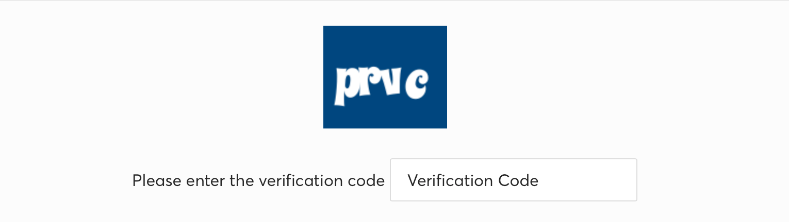
</p>


## Table of Contents

- [How it works](#how-it-works)
  - [Finding an oracle](#finding-an-oracle)
  - [The captcha is open source](#the-captcha-is-open-source)
  - [Training on captchas I render myself](#training-on-captchas-i-render-myself)
- [Models](#models)
- [Project structure](#project-structure)
- [Installation](#installation)
- [Download the models](#download-the-models)
- [Usage](#usage)
  - [Generate captchas](#generate-captchas)
  - [Train a model](#train-a-model)
  - [Benchmark a model](#benchmark-a-model)
  - [Solve a captcha](#solve-a-captcha)
  - [Mix in real captchas](#mix-in-real-captchas)
- [Need antibot solutions?](#need-antibot-solutions)
- [Connect with me](#connect-with-me)

## How it works

Ticketmaster SG and PH use a captcha for validating some actions such as an ATC attempt. 4 letters, white on blue, 120x100, and you meet it on `/ticket/check-captcha/...` right after picking your ticket.

### Finding an oracle

To train a model on a challenge you need a way to know if a read is correct, so you need an **oracle**. There are 2 obvious ones and both cost you.

#### The website itself

A script that opens a session, solves the antibots, adds to cart, reaches the captcha and submits a guess. Obv u can alwasy know for sure if the captcha has been solved correctly, but it would cost you an exagerated amount of time (and resources/money) to get a big dataset u can work with.

<picture>
  <source media="(prefers-color-scheme: dark)" srcset="assets/img/fig-1-dark.png">
  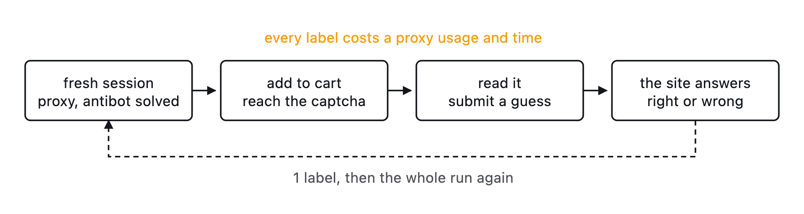
</picture>

#### An external one

Load captchas from `/ticket/captcha?v=1` and have a vision model or a human read them. Cheaper, but the dataset could get saturated by bad solvings.

<picture>
  <source media="(prefers-color-scheme: dark)" srcset="assets/img/fig-2-dark.png">
  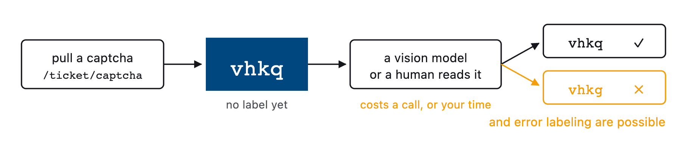
</picture>

So before proceeding with any of those 2 options, I checked the page source.

### The captcha is open source

The script that loads it presents itself as the "Yii Captcha widget":


<p align="left">
  <span>
    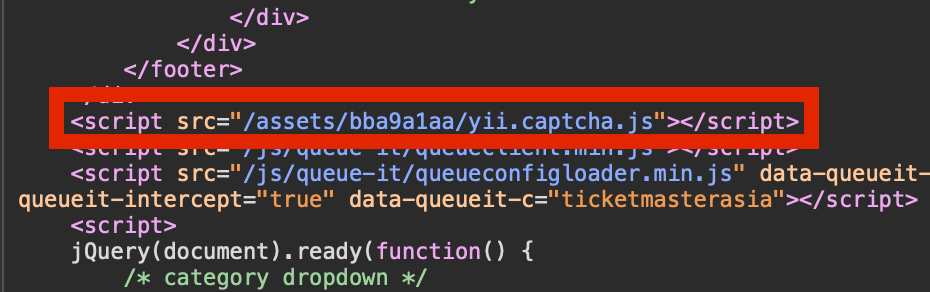
    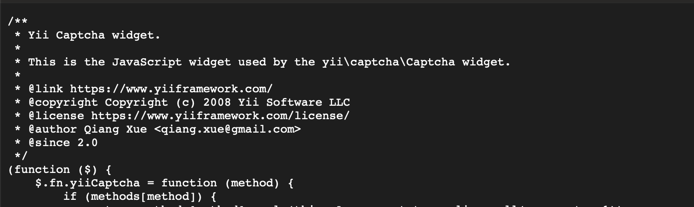
  </span>
</p>

```
https://ticketmaster.ph/assets/bba9a1aa/yii.captcha.js
```


By checking on google, the captcha is from [Yii2](https://github.com/yiisoft/yii2/tree/master/framework/captcha), and Yii2 is open source, which means I can read the function that draws it and port it to a local script: [`CaptchaAction::renderImageByGD`](https://github.com/yiisoft/yii2/blob/db5ff801c63c37e8f8bf4143026804c90a00102e/framework/captcha/CaptchaAction.php#L274).

```php
$x = 10;
$y = round($this->height * 27 / 40);
for ($i = 0; $i < $length; ++$i) {
    $fontSize = (int) (rand(26, 32) * $scale * 0.8);
    $angle = rand(-10, 10);
    $letter = $code[$i];
    $box = imagettftext($image, $fontSize, $angle, $x, $y, $foreColor, $this->fontFile, $letter);
    $x = $box[2] + $this->offset;
}
```

The font is **SpicyRice**. Stock Yii draws 6 to 7 letters from `bcdfghjklmnpqrstvwxyz` and mixes vowels in. The captchas I sampled on Ticketmaster were 4 consonants, so the generator uses `bcdfghjklmnpqrstvwyz`, which gives 160,000 possible codes.

<p align="left">
    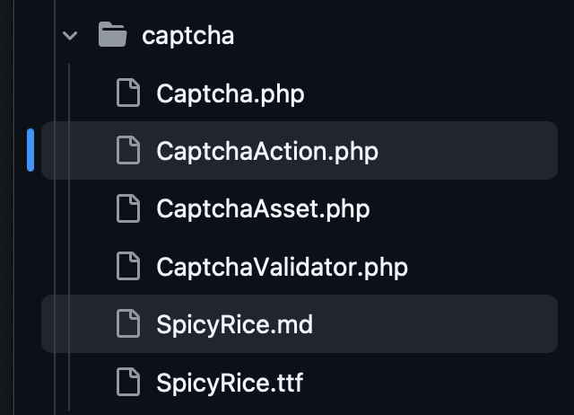
</p>

Comparing the Yii defaults with the target, they changed 5 things (on the TM implementation, guessed by analyzing some loaded captchas):

| Setting | Yii default | Ticketmaster PH / SG |
|---|---|---|
| Image size | 120x50 | 120x100 |
| Background | white `#FFFFFF` | `#00467f` |
| Letters color | `#2040A0` | white |
| Code length | 6 to 7 | 4 |
| Letters | consonants and vowels | consonants only |

`generator.py` is the function ported to Pillow with those 5 settings on top. 

**Note:** The ocnversion is almost hydentical, didn't forced much into getting a perfect 1:1

Captchas generated locally:

<p align="left">
  
  
  
  <br />
  
  
  
</p>

### Training on captchas I render myself

With the generator in hand the oracle is local and free. **The answer exists before the image does**.

<picture>
  <source media="(prefers-color-scheme: dark)" srcset="assets/img/fig-3-dark.png">
  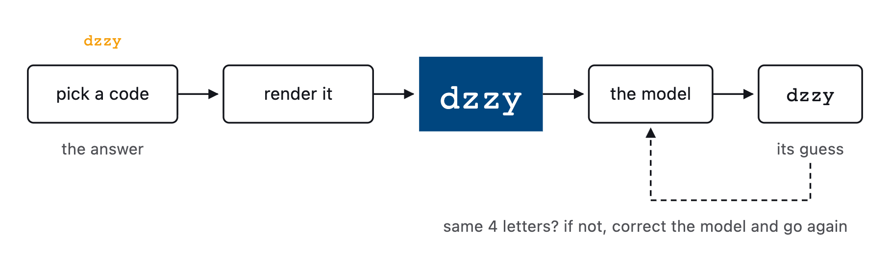
</picture>

Pillow and GD do not rasterise identically, so training images get a light blur, a brightness jitter and some noise on top, which stops the model from learning edges that only Pillow produces. If you have real captchas you already confirmed, you can [mix them in](#mix-in-real-captchas).

Full write-up: [Training a captcha solver by reading the generator instead of the images](https://takionapi.tech/blog/ticketmaster-yii-captcha-solver).

## Models

The output models are pretty small. There are 3 variants with the same structure. The only difference is how many patterns the last layers can learn: more patterns mean a bigger file and more confident reads.

| Release | Channels | Parameters | ONNX size | Accuracy | Speed per solve |
|---------|----------|------------|-----------|----------|-----------------|
| `pico`  | 24       | 45,488     | 186 KB    | 99.19%   | 0.60ms          |
| `nano`  | 32       | 59,744     | 243 KB    | 99.49%   | 0.61ms          |
| `micro` | 64       | 139,808    | 563 KB    | 99.87%   | 0.65ms          |

Accuracy is the share of full codes solved right on 20,000 fresh captchas from `benchmark.py`. Speed is the median of 900 solves, image preprocessing plus inference, on 1 CPU thread of an Apple M4 Max.

Let's keep in mind that on a real flow there's no such thing as a rate limit on failed captchas, so u could use the smaller model and in case of a fail just retry till solved. But during FCFS drops you may wanna get less delay.


<p align="left">
  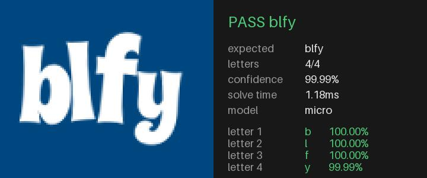
  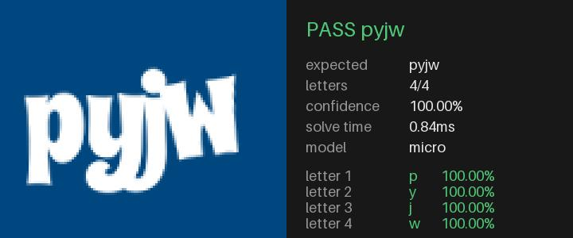
  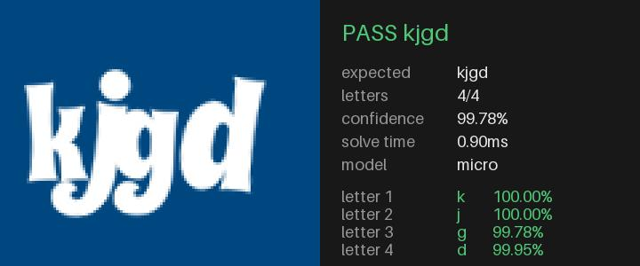
  <br />
  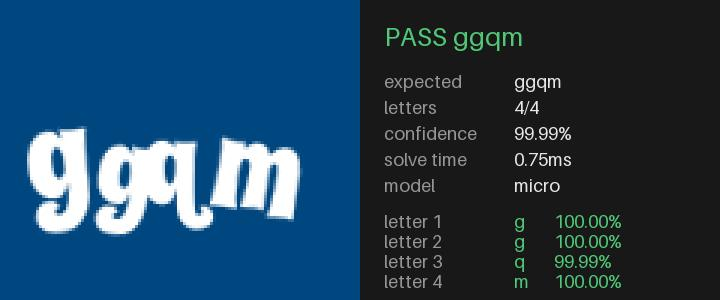
  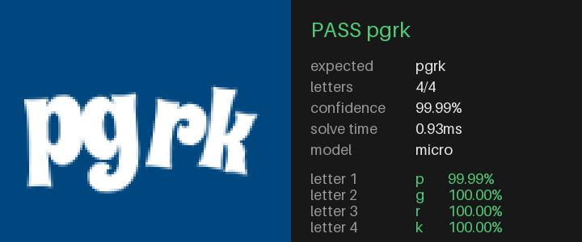
  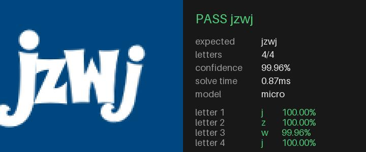
</p>

So why different models you may ask... Can't a guy just have fun?

## Project structure

| File | What it does |
|------|--------------|
| `generator.py` | Python port of `renderImageByGD` with the Ticketmaster SG / PH config |
| `model.py` | `CaptchaNet`, the 3 releases and the device picker |
| `dataset.py` | Image resizing, random distortions, synthetic and real PyTorch datasets |
| `trainer.py` | Trains a release, saves `output/<release>.pt` and exports `output/<release>.onnx` |
| `benchmark.py` | Scores an exported `output/<release>.onnx` for accuracy, confidence gate and speed |
| `test_solve.py` | Solves an image or a base64 string and draws the result card you see above |
| `assets/SpicyRice.ttf` | The font the captcha is drawn with |
| `output/` | Where the trained models land, gitignored and shipped in the releases instead |

## Installation

```bash
git clone https://github.com/glizzykingdreko/ticketmaster-yii-captcha.git
cd ticketmaster-yii-captcha
pip install torch numpy pillow onnxruntime onnx onnxscript
```

`onnx` and `onnxscript` are used by `trainer.py` to export the model to ONNX.

## Download the models

U can find the pre-trained models in [release](https://github.com/glizzykingdreko/ticketmaster-yii-captcha/releases/latest), just drop the one you want in `output/` and you're ready.

```bash
mkdir -p output
curl -L -o output/micro.onnx https://github.com/glizzykingdreko/ticketmaster-yii-captcha/releases/latest/download/micro.onnx
```

[test_solve.py](./test_solve.py) shwos you an example implementation in python.

Swap `micro` for `pico` or `nano`. The `.onnx` file is all you need to solve, the `.pt` one is attached too and only matters if you want to resume training from my weights.

## Usage

### Generate captchas

Don't think this needs much explanation. Running it opens a random captcha in your image viewer.

```bash
python generator.py
```

From code, `sample()` yields `(code, image)` pairs from a seed, so the same seed always gives the same captchas.

```python
from generator import sample

for index, (code, image) in enumerate(sample(6, seed=1)):
    image.save(f"{index}_{code}.png")
```

Seed support is built in, so passing the same seed gives you the exact same captcha again.

```python
from random import Random

from generator import generate_code, render

random = Random(42)
code = generate_code(random)
image = render(code, random)
```

### Train a model

Open `trainer.py`, edit the constants on top and run it.

| Constant | Default | Meaning |
|----------|---------|---------|
| `RELEASE` | `"nano"` | Which model to build, `pico`, `nano` or `micro`, overridden by the command line argument |
| `STEPS` | `4000` | Training steps, each one is a fresh batch |
| `BATCH_SIZE` | `128` | Captchas per step |
| `WORKERS` | `6` | DataLoader workers rendering captchas in parallel |
| `LOG_EVERY` | `250` | How often to score the validation set |
| `USE_REAL` | `False` | Mix in real labelled captchas, see [below](#mix-in-real-captchas) |
| `RESUME` | `False` | Continue from the existing `output/<release>.pt` |

```bash
python trainer.py
```
or

```bash
python trainer.py <model name>
```

It picks `mps`, then `cuda`, then `cpu` on its own. 

Validation runs on 3000 captchas rendered from a different seed than the training ones.

```
[1] Building micro at 64 channels on mps
    validation=3000

[2] Starting from scratch
    parameters=139808

[3] Training for 300 steps
    step   100/300  loss 2.4031  full  15.87%  per letter  63.98%     5s
    step   200/300  loss 0.3797  full  89.83%  per letter  96.82%     8s
    step   300/300  loss 0.1542  full  94.07%  per letter  98.12%    11s

[4] Saved ./output/micro.pt
[=] Exported ./output/micro.onnx
```

`full` is the share of captchas with all 4 letters right, which is the number that matters. `per letter` is there to see how far off the misses are.

Every run gives you 2 files in `output/`:

- `<release>.pt`, the PyTorch weights plus `charset`, `length`, `channels` and `release`. `RESUME` continues training from this one
- `<release>.onnx`, the model `benchmark.py` and the solver use. It runs on ONNX Runtime, so you don't need PyTorch in production

### Benchmark a model

`benchmark.py` loads `output/<RELEASE>.onnx`, the file `trainer.py` exports. Keep `RELEASE` the same in both files.

| Constant | Default | Meaning |
|----------|---------|---------|
| `RELEASE` | `"nano"` | Which exported model to load, overridden by the command line argument |
| `SAMPLES` | `20000` | Synthetic captchas to score |
| `SEED` | `20260916` | Fixed, so two models are scored on the same captchas |
| `GATE` | `0.999` | Confidence below this means pull a fresh captcha |

```bash
python benchmark.py
```

```bash
python benchmark.py <model name>
```

It runs 5 steps:

1. Loads the ONNX model
2. Scores `SAMPLES` fresh synthetic captchas
3. Tests the confidence gate at a few thresholds, showing stats
4. Measures inference speed on CPU, one image at a time
5. Scores real captchas from `dataset/raw/*.png` when there are any. They have no labels, so it only reports how many clear the gate

Output from that same 300-step `micro` model on 2000 samples:

```
[1] Loaded ./output/micro.onnx
    size=0.563MB

[2] Scoring 2000 synthetic captchas
    full=94.600%  per_letter=98.3250%  misses=108

[3] Testing the confidence gate
    >= 0.0      accepted 100.0%  accuracy  94.6000%  misses 108  pulls per solve 1.00
    >= 0.9      accepted  69.8%  accuracy  99.8568%  misses   2  pulls per solve 1.43
    >= 0.99     accepted   5.9%  accuracy 100.0000%  misses   0  pulls per solve 16.81

[4] Measuring single image inference
    0.50ms per image, 2012/s single threaded

[5] Skipping real captchas, none found in ./dataset/raw
```

Half a millisecond per captcha on CPU. And since a wrong read only costs you one extra page, the gate turns a model that misses 5% of them into a solver that misses none, for 16 extra pulls.

### Solve a captcha

`test_solve.py` takes an image path or a base64 string, solves it and draws the result card at the top of this README.

```bash
python test_solve.py
```

The flow itself is 6 lines on a trained model:

```python
import onnxruntime
from PIL import Image

from benchmark import confidence, to_input
from generator import CHARSET, CODE_LENGTH

session = onnxruntime.InferenceSession("output/micro.onnx", providers=["CPUExecutionProvider"])

image = Image.open("captcha.png")
logits = session.run(None, {"input1": to_input(image)[None]})[0]
logits = logits.reshape(1, CODE_LENGTH, len(CHARSET))

answer = "".join(CHARSET[index] for index in logits.argmax(axis=2)[0])
score = confidence(logits)[0]

if score < 0.999:
    print(f"unsure about {answer} ({score:.4f}), pull a fresh captcha")
else:
    print(f"solved {answer} ({score:.4f})")
```

### Mix in real captchas

If you have real captchas from the website, you can mix them in to close the last gap between Pillow and GD rendering (not needed tba)

Drop the images in `dataset/raw/` and describe them in `dataset/labels.json`:

```json
{
    "0001.png": {
        "label": "bcdf",
        "confidence": 0.9995
    },
    "0002.png": {
        "label": "hjkl"
    }
}
```

`confidence` is optional. Entries without a `label` are skipped. Then set `USE_REAL = True` in `trainer.py`. A few dozen images are enough, this is not a dataset you need to go build.

## Need antibot solutions?

<p align="left">
  <a href="https://takionapi.tech">
    
  </a>
</p>

If you don't want to deal with captchas and antibots yourself, check out [TakionAPI](https://takionapi.tech). We know what we're doing. We offer as well a cheap and relaiable solution for `tmpt` compared to competitors.

Start now with a [free trial](https://takionapi.tech/trial)

## Connect with me

If you found this useful, follow me on GitHub and Medium to know when I post or open-source something new.

- [GitHub](https://github.com/glizzykingdreko)
- [Twitter](https://mobile.twitter.com/glizzykingdreko)
- [Medium](https://medium.com/@glizzykingdreko)
- [Email](mailto:glizzykingdreko@protonmail.com)
- [TakionAPI](https://takionapi.tech)
- [Buy me a coffee ❤️](https://www.buymeacoffee.com/glizzykingdreko)
